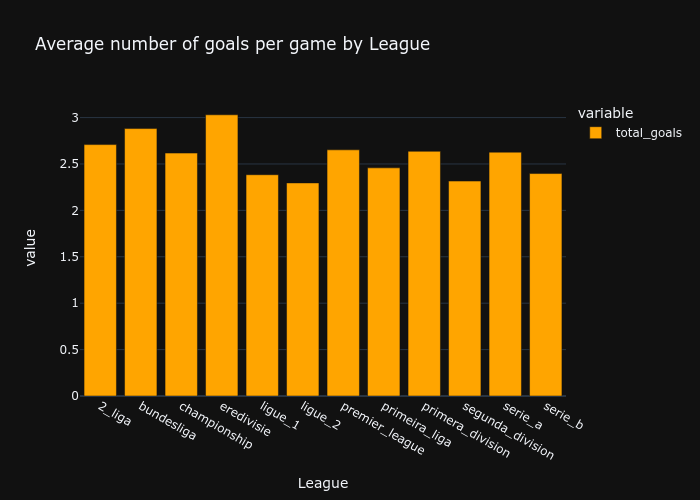
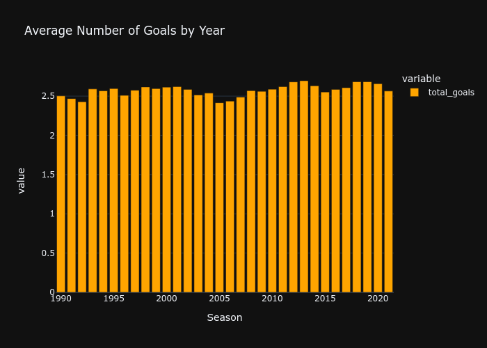
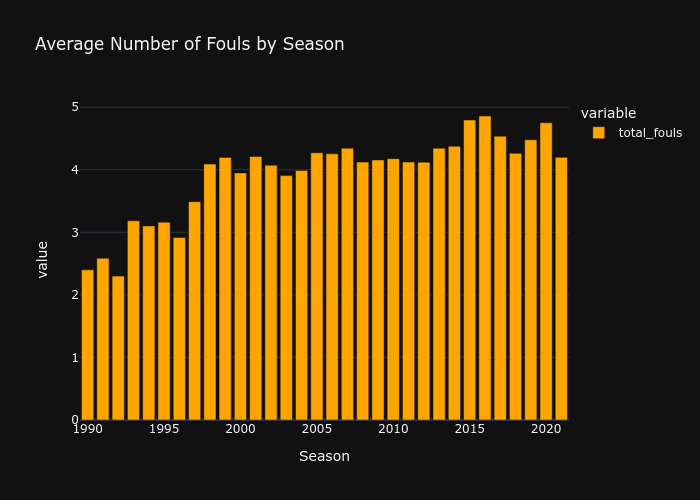
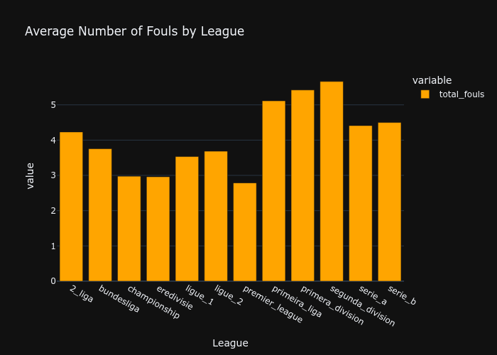
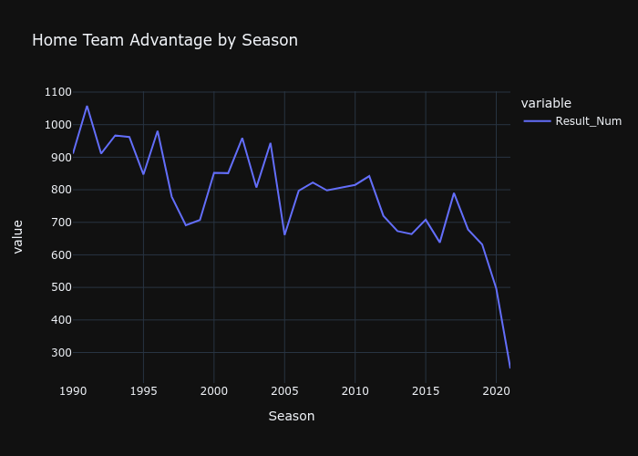
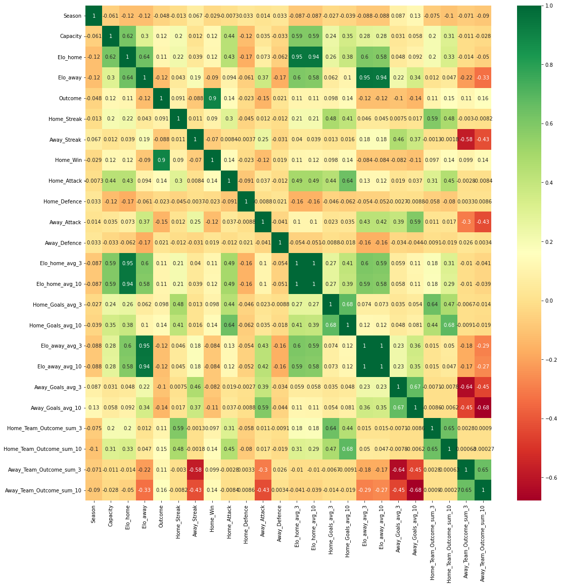

## Football Outcome Predictions

### Overview and Business Problem

In this project a large dataset containing information on Football matches from various different leagues since 1990, is cleaned, analysed and processed to create a ML model to predict the outcomes of matches. 

The business application of such a project is widespread, since betting companies can use ML Models to dynamically change the odds of Football matches in order to maximise profits. 

### Data Cleaning
The data set has 31 csv files for each league, and we have been given data on 14 leagues, therefore there are 434 csv files, that need to be concatenated.  

The files are iteratively added converted into one large pandas data frame using the following for loop. 

```

files = glob.glob("./Football-Dataset/*/*.csv")
pd_list = []

for file in files:
    temp_csv = pd.read_csv(file)
    pd_list.append(temp_csv)

df = pd.concat(pd_list)

```

A dictionary containing ELO's for each match, needs to converted into a Dataframe and joined to the data frame containing match data. Once this is done various steps are taken to clean the data, such as: 
- Removal of null and duplicated values
- Removal of the leagues 'eerste_divisie' and 'segundu_liga' due to lack of values
- Convesion of columns with object or string values to float or integer. 

## Exploratory Data Analysis 

Combining the rows for Home and Away goals, we can analyse how the average amount of goals scored has changed over the past 31 years. 

The figure below show how the average number of goals scored varies by season and league.Accross the 31 seasons goals scored per game remains fairly constant, at around 2.5 goals per game per season. 

<p align='center'>
  
</p>

There is more variation in the average amount of goals scored when analysing by League, with 'eredivisie' and 'Premier League' having a higher amount of goals scored. 

<p align='center'>
  
</p>

Exploring how the average number of fouls have varied by season, we can observe that the average number of fouls were much lower from 1990-1995, and have risen over the years. This is perhaps due to stringent refeering as well innovations such as VAR. 

<p align='center'>
  
</p>

Additionally. the average number of fouls varies significantly by League, as shown in the figure below. Segunda Division has the highest a an average of 5 fouls per game where as the Premier leagues average is less than three. 

<p align='center'>
  
</p>

An important aspect to investigate is if playing at home corraleted with winning. A new column is created for the Result of a match, using the following code. 

```
for idx, match in new_df.iterrows():
    if match['Home_Score'] > match['Away_Score']:
        res = 1
    elif match['Home_Score'] < match['Away_Score']:
        res = -1
    else:
        res = 0
    new_df.loc[ idx, 'Result_Num'] = res

```

The Result_Num is 1 when the Home team wins, 0 when the match is a draw and -1 when the away team wins. Therefore, if the Result_Num is high for a given season this means the Home team won more often than the away team. 

As seen in the figure below, From 1900 till 2016 the home team would will a lot more games than the away team, however this Home Team Advantage has decreases sharply after 2016. 

<p align='center'>
  
</p>

## Feature Engineering
New features need to be created before we can build the machine learning model Pandas and Numpy are used to isolate, manipulate and aggregate data in various ways, the end goal of this step is to produce a clean data set with only numerical values, that can be interpreted by ML models. 

The first step is to convert the 'Date_New' Column into a time stamp, so data can be organised chronologically. 

Various additional features are created, for instance:

- Winnging steak for home, away and both. 
- Form i.e. sum of outcomes for last 5 matches for home, away and both. 
- Goals scored over the last 20 matches. 

Additionally, non-numerical data sets are removed. 

## Upload Data to Database
The next step of the project is to set up an AWS RDS instance, and upsert data. This has been done on previous projects, therefore does not take long. 

Additionally steps are compiled into a pipeline.

## Model Creation

Now the data has been cleaned and transformed into numerical form that can be understood by ML algorithms, ML models can be created. 

Feature heatmaps are used to find correlation between features, so features that have a high correlation with the outcome of the game can be selected. This is dont to boost the performance of our ML models. 

From the heatmap below we can see that a Home win is has high correlation with the following features, Home Team Outcome, Capacity, Elo_home,Elo_away. 

<p align='center'>
  
</p>

The next step is to drop irrelevant elements features and to build the Model using sklearn. Accuracy is selected to be the metric we are optimizing for since, false positives and false negatives are equally important as each other. 

The models and respective accuracy are given in the table below. 

          | Model                        | Accuracy  |
          |------------------------------|-----------|
          | Logistic Regression          | 60.5%     |
          | Random Forest Classifier     | 58.46%    |
          | KNeighbors Classifier        | 56.23%    |
          | Decision Tree Classifier     | 54.05%    |
          | AdaBoost Classifier          | 60.25%    |
          | Gradient Boosting Classifier | 60.55%    |

The next step of the project is to hypertune paramters to achieve create optimal model architecture.
GridSearch method is used to hypertune the ML models. 

```
n_estimators = [int(x) for x in np.linspace(start = 10, stop = 20, num = 10)]
min_split = [int(x) for x in np.linspace(start = 100, stop = 150, num = 50)]
max_depth = [int(x) for x in np.linspace(10, 2, num = 2)]
min_leaf = [int(x) for x in np.linspace(start = 1, stop = 10, num = 5)]
max_features = [int(x) for x in np.linspace(start = 7, stop = 7, num = 7)]

grid = {'n_estimators': n_estimators,
        'min_samples_split': min_split,
        'max_depth': max_depth,
        'min_samples_leaf': min_leaf,
        'max_features': max_features,
        'subsample':[0.6,0.7,0.75,0.8,0.85,0.9,1.0],
        }

model_2 = GradientBoostingClassifier(n_estimators= 130, learning_rate=0.1, max_depth=2, min_samples_split=100, max_features=7, subsample = 0.9)
grid_search = GridSearchCV(model_2, grid, cv = 3, verbose=2, n_jobs = -1)
grid_result = grid_search.fit(X_train, y_train)
print(f'Best Score: {grid_result.best_score_ * 100:.2f}%')
print(f'Best Hyperparameters: {grid_result.best_params_}')

```
Using this method, the model accuracy for the Gradient Boost model increases from 60.5% to 60.87%. 